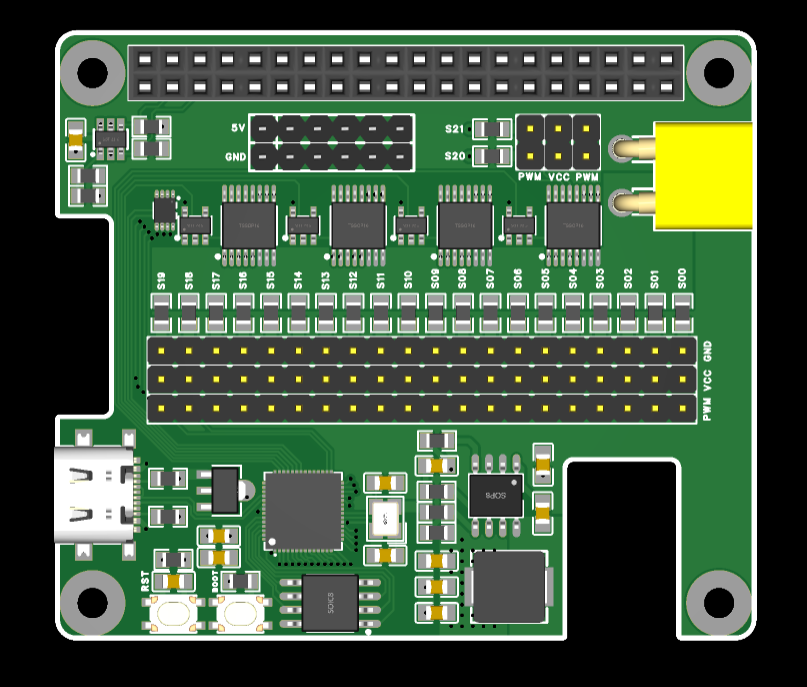
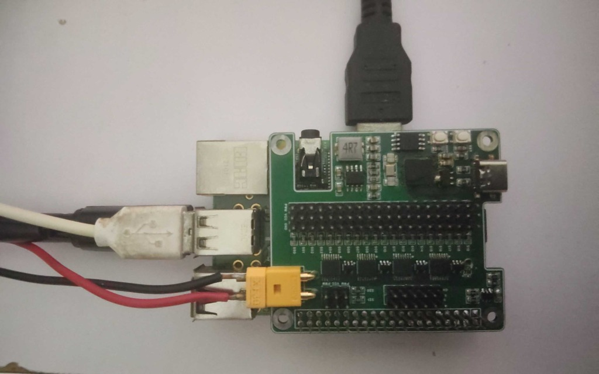
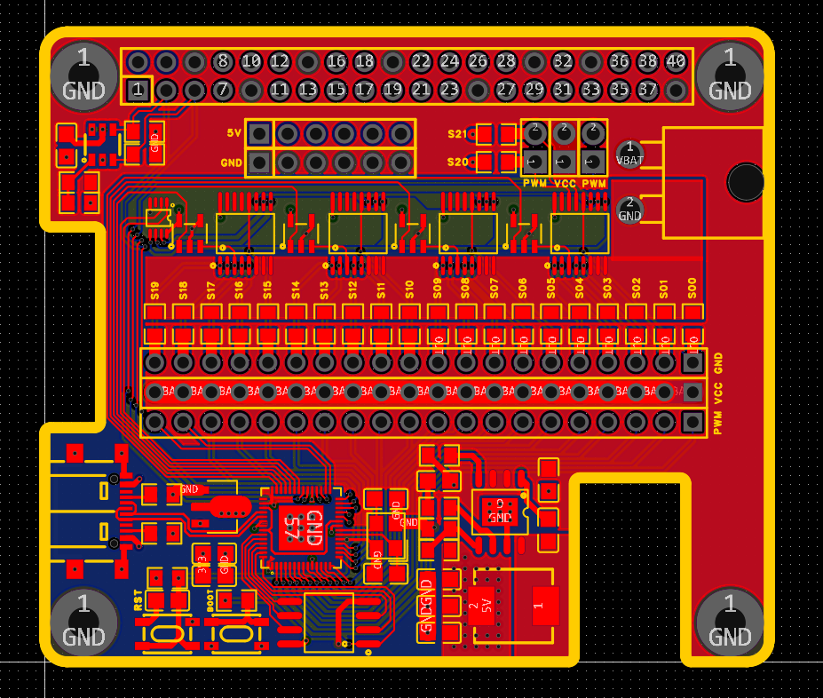
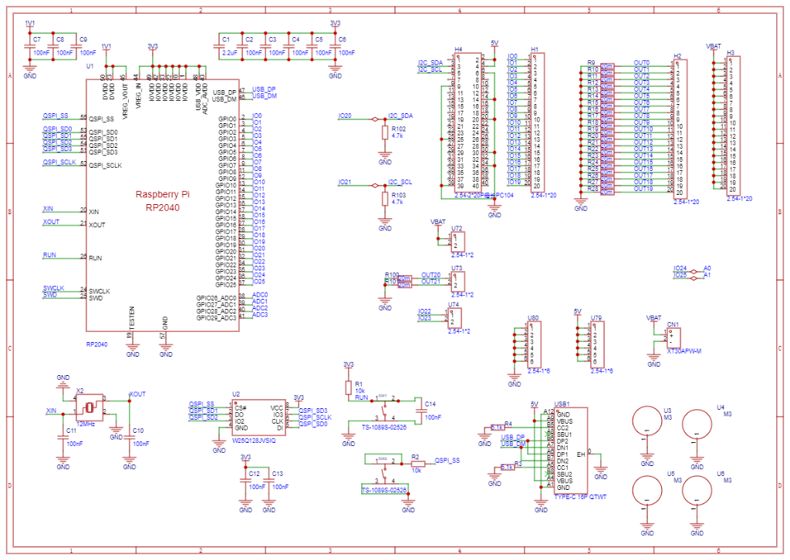
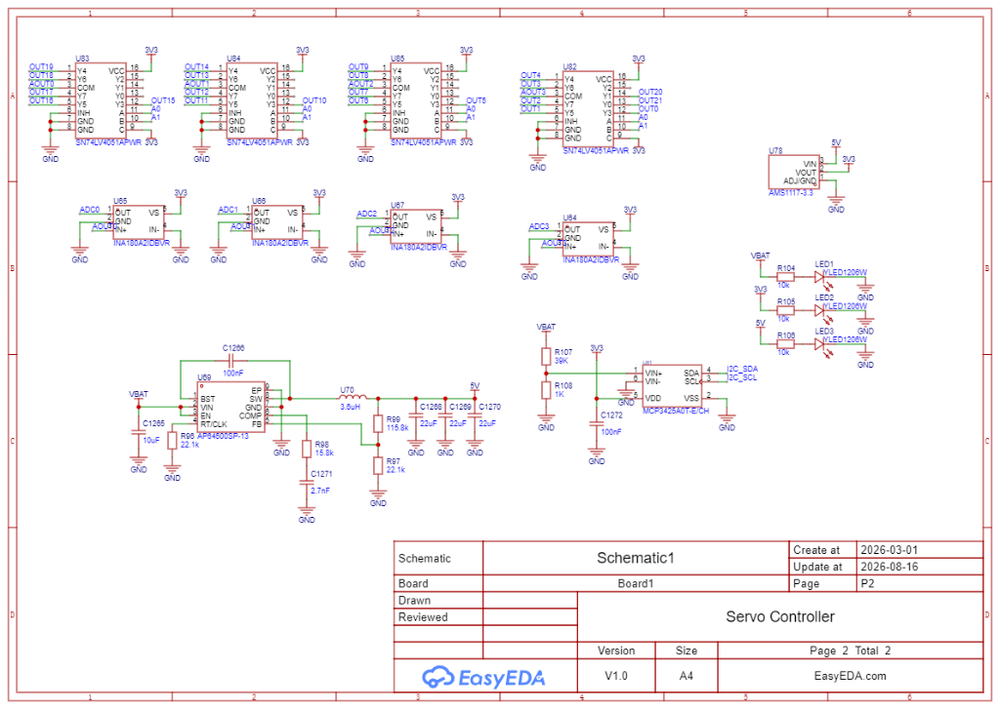
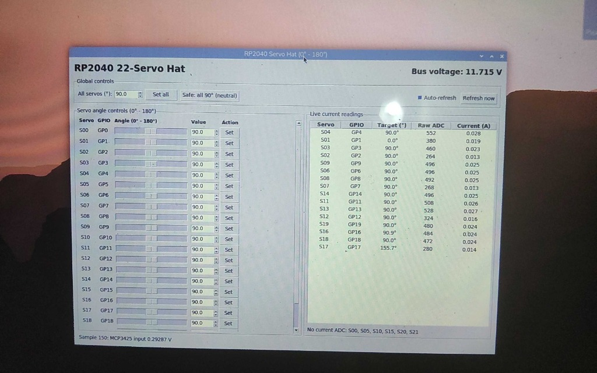

# RP2040 22-Servo HAT + Raspberry Pi Master

A high-performance servo control and telemetry system for robotics, pan-tilt mechanisms, and multi-axis actuators over an I2C bus.

<p align="center">
  
  
</p>

The system connects a **Raspberry Pi** (acting as the I2C Master) to an **RP2040 coprocessor** (acting as an I2C Slave, 50 Hz PWM generator, and analog telemetry scanner) alongside an onboard **MCP3425A0T** 16-bit $\Delta\Sigma$ ADC.

Servos are commanded by **Angle ($0^\circ \dots 180^\circ$)**, matching the Arduino `Servo.write(angle)` API, or directly by **Pulse Width ($1000 \dots 2000\,\mu\text{s}$)**:
* **$0^\circ \iff 1000\,\mu\text{s}$**
* **$90^\circ \iff 1500\,\mu\text{s}$** (Neutral / Default Starting Position)
* **$180^\circ \iff 2000\,\mu\text{s}$**

---

## Features

* **Precise 50 Hz Hardware PWM**: Direct nanosecond hardware timing (`duty_ns`) with all PWM slices pre-initialized at power-on to eliminate startup glitching.
* **Zero-Allocation I2C Slave Driver**: Custom register-level driver running in MicroPython with zero heap allocations during runtime transactions, eliminating garbage-collection latency.
* **16-Channel Live Current Sensing**: Reads individual servo shunt currents using dual 74HC4052 analog multiplexers and RP2040 internal ADCs.
* **16-bit Bus Voltage Telemetry**: High-precision power rail monitoring via MCP3425A0T over I2C.
* **Multiple Master Interfaces**:
  * **CLI Tool (`rpi_master.py`)**: Scriptable command-line interface for individual/global servo angles and telemetry queries.
  * **Interactive TUI (`servo_tui.py`)**: Real-time terminal interface with curses keyboard controls and live telemetry displays.
  * **Desktop GUI (`servo_gui.py`)**: Tkinter graphical dashboard with interactive angle sliders and live current tables.
  * **Python Scripting API**: Clean, importable module (`import rpi_master as servo_hat`) for automated robotic workflows.

---

## System Architecture

The HAT separates high-level control logic from deterministic hardware PWM generation:

```
┌────────────────────────────────────────────────────────┐
│               Raspberry Pi (I2C Master)                │
│    Python CLI (rpi_master) / TUI / GUI / User App      │
└───────────────┬────────────────────────┬───────────────┘
                │ I2C Bus 1              │ I2C Bus 1
                │ (Address 0x2A)         │ (Address 0x68)
                ▼                        ▼
┌──────────────────────────────┐  ┌──────────────────────┐
│       RP2040 Coprocessor     │  │     MCP3425A0T       │
│  • MicroPython I2C Slave     │  │  16-bit Delta-Sigma  │
│  • 22x 50 Hz PWM Drivers     │  │  Bus Voltage Sensor  │
│  • 16-Ch Current ADC Scanner │  └──────────────────────┘
└───────────────┬──────────────┘
                │ Dual 74HC4052 MUX
                ▼
┌──────────────────────────────┐
│  16x Shunt Current Sensors   │
│  + 22x Servo PWM Connectors  │
└──────────────────────────────┘
```

* **Raspberry Pi (Master)**: Executes user application code, kinematic calculations, or UI scripts over Linux `/dev/i2c-1`.
* **RP2040 Coprocessor (Slave `0x2A`)**: Manages the low-level real-time tasks:
  * Generates stable $50\,\text{Hz}$ servo PWM pulse streams with microsecond/nanosecond resolution.
  * Rapidly samples 16 current shunts through dual 74HC4052 analog multiplexers into pre-allocated binary telemetry buffers.
* **MCP3425A0T (ADC `0x68`)**: Monolithically measures the external servo power supply rail (with an onboard precision resistor divider), providing live bus voltage to the Raspberry Pi.

<p align="center">
  
</p>

### Hardware Schematics

<details>
<summary><b>Click to expand Hardware Schematics (Pages 1 & 2)</b></summary>

#### Schematic Page 1: RP2040 MCU, Flash, USB Type-C & Headers
<p align="center">
  
</p>

#### Schematic Page 2: Power Regulation, INA180 Current Sensing, Multiplexing & MCP3425 ADC
<p align="center">
  
</p>

</details>

---

## Setup & Installation

### Step 1: RP2040 Firmware Setup

1. Flash the latest **MicroPython** firmware (UF2) to your Raspberry Pi Pico / RP2040 board.
2. Open Thonny or your preferred MicroPython IDE and connect to the Pico over USB.
3. Upload [`rp2040/main.py`](rp2040/main.py) to the root directory of the Pico as **`main.py`**.
4. Soft-reset (Ctrl+D) or power-cycle the Pico. The console will display:
   ```text
   Initialized 22/22 servo PWM channels at 50 Hz (default starting angles)
   RP2040 servo slave ready: I2C0 GP20/GP21, address 0x2A
   ```

---

### Step 2: Raspberry Pi Master Setup

1. Enable the I2C interface on your Raspberry Pi:
   ```bash
   sudo raspi-config
   # Navigate to: Interfacing Options -> I2C -> Enable -> Yes -> Finish
   ```

2. Clone the repository:
   ```bash
   git clone https://github.com/Klutzhehe/RPIServoHat.git
   cd RPIServoHat
   ```

3. Create and activate a Python virtual environment:
   ```bash
   python3 -m venv venv
   source venv/bin/activate
   ```

4. Install required dependencies:
   ```bash
   pip install -r requirements.txt
   ```

5. Verify that both I2C devices are detected on bus 1:
   ```bash
   sudo i2cdetect -y 1
   ```
   * Address **`0x2A`** (RP2040 Slave) and **`0x68`** (MCP3425 ADC) should appear in the grid.

---

## Master Interfaces & Usage

> [!TIP]
> Ensure your virtual environment is active (`source venv/bin/activate`) when running any of the master scripts.

### 1. Command-Line Interface (`rpi_master.py`)

```bash
# Set individual servo angle (0° to 180°):
python3 rpi_master.py set 0 90          # Set S0 to 90° (neutral)
python3 rpi_master.py set 1 0           # Set S1 to 0° (1000 µs)
python3 rpi_master.py set 1 180         # Set S1 to 180° (2000 µs)

# Set all servos simultaneously:
python3 rpi_master.py all 90            # Center all servos at 90°
python3 rpi_master.py all 45            # Move all servos to 45°

# Return all servos to safe starting positions:
python3 rpi_master.py safe

# Direct microsecond pulse width control (1000 - 2000 µs):
python3 rpi_master.py set-pulse 0 1500  # Set S0 pulse width to 1500 µs
python3 rpi_master.py all-pulse 1250    # Set all servos to 1250 µs

# Read active target positions:
python3 rpi_master.py targets

# Read bus voltage and live 16-channel currents:
python3 rpi_master.py read

# Continuously monitor telemetry in terminal:
python3 rpi_master.py monitor --interval 0.5
```

---

### 2. Interactive Terminal UI (`servo_tui.py`)

A full-screen, double-buffered curses application designed for fast, real-time manual control over SSH or local terminal:

```bash
python3 servo_tui.py
```

#### Keyboard Controls:
| Key | Action |
| :--- | :--- |
| `↑` / `↓` (or `k` / `j`) | Select servo (`S00` .. `S21`) |
| `←` / `→` (or `h` / `l`) | Fine adjust angle ($\pm 1^\circ$) |
| `[` / `]` (or `PgUp` / `PgDn`) | Coarse adjust angle ($\pm 10^\circ$) |
| `Home` / `End` | Jump to $0^\circ$ / $180^\circ$ limits |
| `0` .. `9` | Instant angle presets ($0^\circ, 20^\circ, 40^\circ, \dots, 180^\circ$) |
| `a` / `A` | Set **ALL servos** to currently selected angle |
| `s` / `S` | Return all servos to **Safe / Starting angles** |
| `q` / `ESC` | Quit application |

---

### 3. Desktop Graphical UI (`servo_gui.py`)

For Raspberry Pi Desktop or VNC/X11 environments:

```bash
# Ensure Tkinter is installed:
sudo apt install -y python3-tk

# Launch the GUI:
python3 servo_gui.py
```

<p align="center">
  
</p>

Features interactive angle sliders, spinbox numeric inputs, global **Set All** / **Safe** buttons, and a live current telemetry table.

---

### 4. Python Scripting Library

You can directly import `rpi_master` in your custom Python robotics scripts:

```python
from smbus2 import SMBus
import rpi_master as servo_hat

with SMBus(servo_hat.I2C_BUS) as bus:
    # 1. Command individual servos by angle:
    servo_hat.set_servo(bus, servo=0, pos=90.0)
    servo_hat.set_servo(bus, servo=1, pos=180.0)

    # 2. Command all servos simultaneously:
    servo_hat.set_all_servos(bus, pos=45.0)

    # 3. Read active target pulse widths (1000..2000 µs):
    targets = servo_hat.read_servo_targets(bus)
    for servo_id, pulse in enumerate(targets):
        angle = servo_hat.pulse_to_angle(pulse)
        print(f"S{servo_id:02d}: {angle:5.1f}° ({pulse} µs)")

    # 4. Read bus voltage and live currents:
    v_bus, v_div, raw_mcp = servo_hat.read_mcp3425_bus_voltage(bus)
    seq, raw_adcs = servo_hat.read_servo_adc(bus)
    print(f"Bus Voltage: {v_bus:.2f} V")
```

---

### 5. Example Scripts

The [`examples/`](examples/) directory includes ready-to-run automation scripts:

* **[`examples/single_servo_sweep.py`](examples/single_servo_sweep.py)**: Sweeps an individual servo back and forth continuously:
  ```bash
  python3 examples/single_servo_sweep.py 0 --min-angle 60 --max-angle 120 --step 2
  ```
* **[`examples/set_pose.py`](examples/set_pose.py)**: Sets multiple servos to a predefined posture dictionary:
  ```bash
  python3 examples/set_pose.py
  ```
* **[`examples/read_telemetry.py`](examples/read_telemetry.py)**: Continuously logs voltage and current sensor telemetry:
  ```bash
  python3 examples/read_telemetry.py
  ```

---

## I2C Protocol Specification

### Binary Command Format (Master $\rightarrow$ Slave)

| Command Name | Opcode | Payload Format | Description |
| :--- | :---: | :--- | :--- |
| **Set Servo** | `0x01` | `[0x01, servo_id, pulse_hi, pulse_lo]` | Sets target pulse width ($1000 \dots 2000\,\mu\text{s}$) for servo `0..21`. |
| **Set All Servos** | `0x02` | `[0x02, pulse_hi, pulse_lo]` | Sets all 22 PWM outputs to the same pulse width. |
| **Safe Position** | `0x03` | `[0x03]` | Resets all servos to configured starting angles. |
| **Read Current ADCs** | `0x10` | Write `[0x10]`, then read 36 bytes | Reads 16-channel current-sense raw ADC readings. |
| **Read Target Angles** | `0x11` | Write `[0x11]`, then read 48 bytes | Reads active target pulse widths for all 22 servos. |

### Telemetry Packet Structures (Slave $\rightarrow$ Master)

* **Current Sense Report (`0x10`) — 36 Bytes**:
  * Byte 0: Magic Byte (`0xA5`)
  * Byte 1: Protocol Version (`0x01`)
  * Byte 2: Scan Sequence Counter
  * Byte 3: Channel Count (`0x10` / 16 channels)
  * Bytes 4–35: $16 \times \text{uint16}$ (big-endian raw 16-bit ADC values)
* **Target Angles Report (`0x11`) — 48 Bytes**:
  * Byte 0: Magic Byte (`0xB5`)
  * Byte 1: Protocol Version (`0x01`)
  * Byte 2: Servo Count (`0x16` / 22 servos)
  * Byte 3: Reserved (`0x00`)
  * Bytes 4–47: $22 \times \text{uint16}$ (big-endian target pulse widths in $\mu\text{s}$)

---

## License

This project is licensed under the MIT License.
